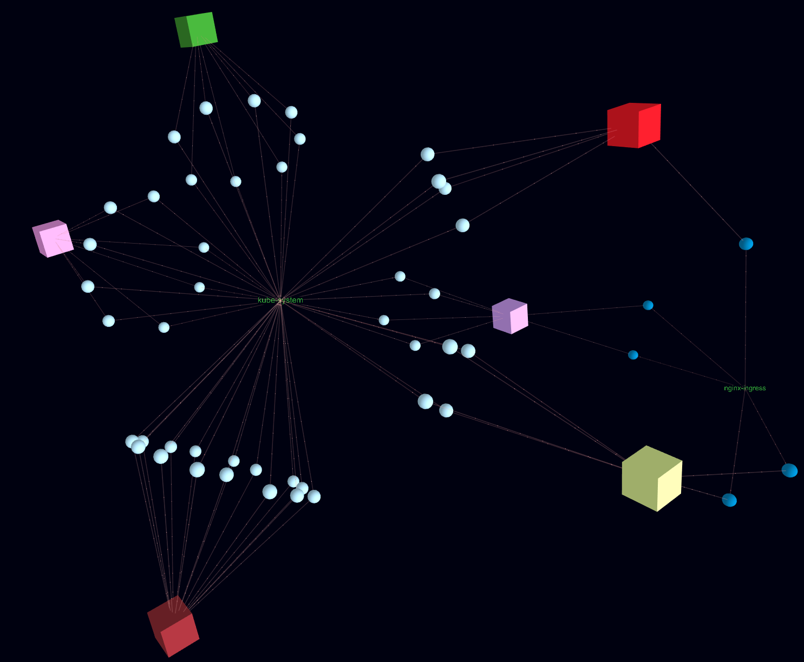

# kube-universe


---



## Overview

Kube-Universe renders a Kubernetes cluster into a dynamic 3D graph. An example landscape visualization can be found [here](images/universe.png).

A __Live Demo Version__ is available [here](https://afritzler.github.io/kube-universe/web/demo/)

## Features

* 3D cluster overview
* Identify pods with errors

## Installation and Usage

Before you start you need to install `statik` to vendor the web content into executable

```bash
go get github.com/rakyll/statik
```

Get the `kube-universe` binary

```bash
go get github.com/afritzler/kube-universe
```

Start `kube-universe` locally

```bash
kube-universe serve --kubeconfig=PATH_TO_MY_KUBECONFIG
```

or just

```bash
kube-universe serve
```

if you are using minikube or have the `KUBECONFIG` environment variable pointing to a corresponding cluster.

The web UI can be accessed via http://localhost:3000 and the rendered graph under http://localhost:3000/graph.
With the `--port` flag you can also specify under which port the kube universe server should be exposed (default is 3000).

## Development

To build and run the kube universe

```bash
git clone https://github.com/afritzler/kube-universe $GOPATH/src/github.com/afritzler/kube-universe
cd $GOPATH/src/github.com/afritzler/kube-universe
go run *.go serve --kubeconfig=PATH_TO_MY_KUBECONFIG
```

or to build and run it using the executable

```bash
make
./kube-universe serve --kubeconfig=PATH_TO_MY_KUBECONFIG
```

To build the Docker image

```bash
cd $GOPATH/src/github.com/afritzler/kube-universe
make docker-build
```

## Acknowledgements

Kube universe is using [3d-force-graph](https://github.com/vasturiano/3d-force-graph) for rendering.
